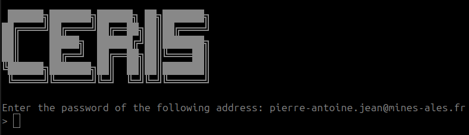
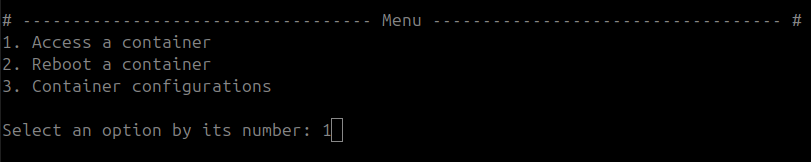
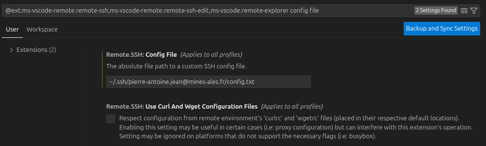
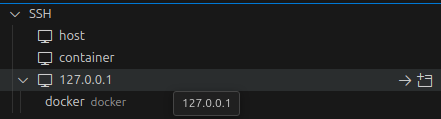
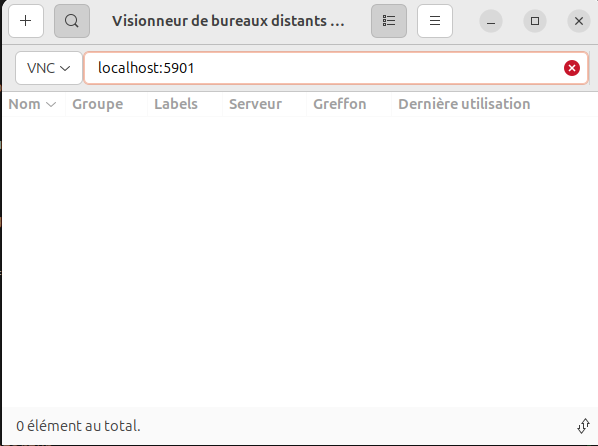
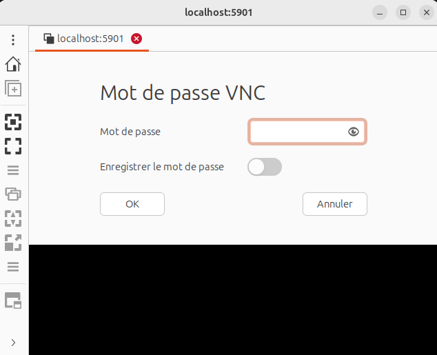
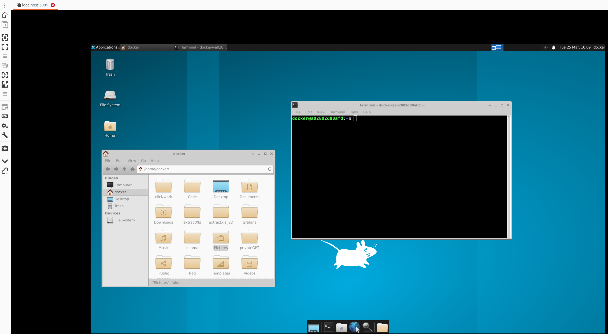

# Documentation à propos de l'utilisation des serveurs de calcul

Cette documentation vous guide dans la connexion et l'utilisation des serveurs de calcul, en facilitant l'accès aux conteneurs, le développement à distance et le transfert de fichiers.

## Informations personnelles de connexion

La pièce-jointe reçu par mail (authentication.zip) contient une clé d'authentification personnelle. Le contenu du fichier doit être placé dans votre dossier `C:\Users\<votre nom d'utilisateur>\.ssh\` avec Windows ou bien dans votre dossier `/home/<votre nom d'utilisateur>/.ssh` sous Linux.

## Connexion standard

La commande standard (à réaliser depuis l'intérieur du dossier) pour accéder à votre container de calcul est la suivante. 

```bash
ssh -F config.txt container
```

Suite à cette commande, votre mot de passe de messagerie est requis (les caractères n'apparaissent pas à l'écran).

<div align="center">
    
</div>

Une fois l'authentification réalisée, vous aurez accès à trois options. Indiquez le numéro correspondant :

* **1** - Accéder à l'un de vos conteneurs.
* **2** - Redémarrer l'un de vos conteneurs.
* **3** - Afficher les configurations de l'un de vos conteneurs.

<div align="center">
    
</div>

Après avoir saisi l'option, indiquez le numéro du conteneur concerné. Cette connexion standard permet d'accéder au terminal du conteneur.

## Connexion et redirection de port

Si vous souhaitez ouvrir un ou plusieurs ports, utilisez les options `-L` et `-t` :

* `-L` : Associe un port local à un port proxy.

* `-t` : Associe le port proxy à un port du conteneur de calcul.

Exemple:

```bash
ssh -L 8080:localhost:8080 -L 2222:localhost:2222 -F config.txt container -t 8080:8080 2222:22
```

Cet exemple associe le port local `8080` au port `8080` du conteneur et le port local `2222` au port `22` du conteneur.

### Utilisation de VS Code avec l'extension SSH Remote

Vous pouvez ouvrir une session VS Code sur un environnement distant en utilisant l'extension Remote - SSH, qui permet une expérience de développement fluide comme si vous développiez localement.

* Connectez-vous à votre conteneur.

```bash
ssh -L 2222:localhost:2222 -F config.txt container -t 2222:22
```

* Installer l'extension Remote - SSH depuis le marketplace de VSCode.

* Configurez l'extension pour qu'elle pointe vers votre fichier `config.txt`.

<div align="center">
    
</div>

* Démarrer l'instance en cliquant sur l'hôte 127.0.0.1 (ou docker).

<div align="center">
    
</div>

### Utilisation de JupyterLab

* Connectez-vous à votre conteneur.

```bash
ssh -L 8080:localhost:8080 -F config.txt container -t 8080:8080
```

* Télécharger jupyter-lab.

```bash
pip install jupyterlab
```

* Lancer jupyter-lab.

```bash
jupyter-lab --ip=0.0.0.0 --port=8080 --allow-root --IdentityProvider.token=''
```

* Accédez à JupyterLab via l'URL suivante : `http://127.0.0.1:8080/lab`.


## Transferts de fichiers

Pour transférer un fichier ou un dossier depuis votre local vers le conteneur et vice verca

* Connectez-vous à votre conteneur.

```bash
ssh -L 2222:localhost:2222 -F config.txt container -t 2222:22
```

* Ouver un nouveau terminal.

* Pour transférer un fichier ou un dossier de votre machine locale vers le conteneur.

```bash
scp -r -F config.txt <lien_fichier_local>  127.0.0.1:/home/docker/<lien_destination_distant>
```

* Pour transférer un fichier ou un dossier du conteneur vers votre machine locale :

```bash
scp -r -F config.txt 127.0.0.1:<lien_fichier_distant>  <lien_destination_local>
```

## Montage d'un système de fichiers distant avec `sshfs`

La commande sshfs permet de monter un système de fichiers distant via SSH, offrant ainsi un accès transparent aux fichiers d'un de vos conteneurs comme s'ils étaient locaux. Cette fonctionnalité est particulièrement utile pour manipuler les fichiers d'un conteneur de calcul sans avoir à les transférer manuellement.

* Connectez-vous à votre conteneur.

```bash
ssh -L 2222:localhost:2222 -F config.txt container -t 2222:22
```

* Ouver un nouveau terminal.

* Exécutez la commande suivante pour monter le système de fichiers.

```bash
sshfs -F /home/<nom_utilisateur>/.ssh/<adresse_mail>/config.txt 127.0.0.1:/home/docker/<lien_dossier_distant> <lien_dossier_local>
```

## Créer un bureau distant

* Connectez-vous à votre conteneur.

```bash
ssh -L 5901:localhost:5901 -F config.txt container -t 5901:5901
```

* Installer un environnement graphique et un serveur VNC.

```bash
sudo apt update
sudo apt install -y xfce4 xfce4-goodies tightvncserver
```

* Ajouter les lignes suivantes au sein du fichier `~/.vnc/xstartup`. Vous pouvez utiliser la commande `nano ~/.vnc/xstartup`.

```
#!/bin/bash
xrdb /home/docker/.Xresources
startxfce4 &
```

* Modifier les droits du fichier `~/.vnc/xstartup`.

```bash
chown docker:docker .vnc/xstartup
chmod +x .vnc/xstartup
```

* Démarrer le serveur VNC. Vous allez devoir créer un mot de passe de session.

```bash
vncserver -rfbport 5901 -geometry 1920x1080
```

* Sur votre machine local, télécharger un client VNC (ex. https://github.com/TigerVNC/tigervnc/releases). Sous ubuntu, vous pouvez utiliser l'utilitaire Remmina.

<div align="center">
    
</div>

<div align="center">
    
</div>

<div align="center">
    
</div>

Si vous voulez arrêter votre serveur VNC sur votre conteneur.

```bash
vncserver -kill :1
```